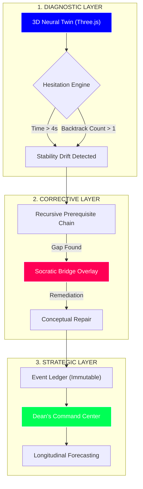

# AXIOM: The Cognitive Operating System 🧠🌐

[](https://vercel.com)
[](https://github.com/TruthStack)
[](https://en.wikipedia.org/wiki/Bayesian_Knowledge_Tracing)
[](https://opensource.org/licenses/MIT)
[](https://github.com/TruthStack)

> **"Mastery is no longer intuitive. It is predictable."**

Axiom is a high-valuation **Cognitive GPS** designed to map the invisible landscape of human learning. By combining **Neural Telemetry** with **Recursive Prerequisite Tracing**, Axiom detects the precise moment a student's confidence drifts, intervenes at the foundational root cause, and provides an immutable audit trail for institutional verification.

---

## 🗺️ Legendary Architecture Map



---

## 💎 The 3-Layer Infrastructure

### 🚀 Layer 1: The Neural Twin (Diagnostic)
*   **3D Volumetric Visualization**: Real-time rendering of the student's knowledge state across neurological lobes.
*   **High-Fidelity Telemetry**: Tracks micro-behaviors like cursor backtracking and jitter to identify cognitive load spikes before they lead to failure.

### 🌉 Layer 2: The Socratic Bridge (Corrective)
*   **Prerequisite Intelligence**: Uses a recursive knowledge graph to find the foundational "Deep Gap."
*   **Adaptive Repair**: Automatically intercepts sessions to build bridges over conceptual deficiencies.

### 🏛️ Layer 3: The Dean's Command Center (Strategic)
*   **Cognitive Ledger**: An immutable, event-sourced audit trail of every student interaction.
*   **Institutional Forecasting**: Longitudinal modeling that predicts board pass rates and semester-long stability trends.

---

## 🛠️ Technical Moat

| Technology | Implementation | Venture Value |
|------------|----------------|---------------|
| **Vite + React 19** | Optimized SPA Core | High Performance / Low Latency |
| **Three.js** | 3D Volumetric Engine | Proprietary Visual Moat |
| **Zustand** | Stable State Management | Predictable UI Logic |
| **SM-2 Algorithm** | Knowledge Decay Modeling | Retention-as-a-Service |
| **Event Sourcing** | Immutable Interaction Log | B2B Audit Compliance |

---

## 🏁 Quick Start

### Development Mode
```bash
npm install
npm run dev
```

### Production Build
```bash
npm run build
npm run preview
```

### Institutional Audit
Navigate to `/evidence` to access the **Evidence Locker** and export the certified cognitive audit trail.

---

## 🤝 Built by TruthStack
Pushing the boundaries of cognitive infrastructure. Axiom is part of the **TruthStack** ecosystem — building the verifiable future.

---

&copy; 2026 Axiom Systems. Built for the high-stakes future of education.
